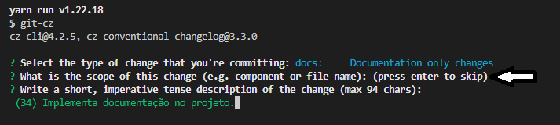
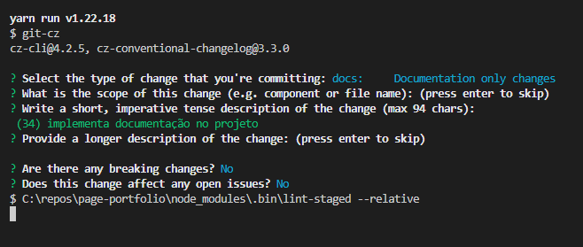

<H1 align="center">Portifolio</H1>

<div align="center">

 [](https://coveralls.io/github/g-aleprojetos-Projects/page-portfolio?branch=main&kill_cache=1)
 [](https://tldrlegal.com/license/mit-license)


</div>

## Setup

- Ferramentas necessárias:
  - Visual Studio Code
  - Git
  - yarn (1.22.18)
  - React (18.2.0)
  - Typescript
  - Prettier (plugin do VSCode recomendado)
  - ESLint (plugin do VSCode recomendado)

## Políticas de Código

[Políticas e padrões de código](./docs/padroes-de-codigo.md)

## Executar o projeto na máquina local

```shell
yarn start
```

## Executando teste
- Para rodar os testes, executar o comando:
```shell
yarn test
```

- Para atualizar os snapshots, executar o comando:
```shell
yarn test -u
```

## Branches

As branches principais são:

- **main**
- **develop**

### Regras para novos desenvolvimentos:

- _feature/[nome-da-feature]/main_ - Para trabalhos relacionados a uma estória, derivar a branch a partir da **develop** com nome relacionado (Ex.: \*\*feature/tela-selecionar-local/main)
- _feature/[nome-da-feature]-[nome-da-tarefa]_ Para trabalhos relacionados a uma tarefa, derivar a branch a partir da **feature branch**, com nome relacionado (Ex.: _feature/tela-selecionar-local/configurar-api_)
- _hotfix/[nome-da-correcao]_ - Para trabalhos relacionados à correção de um bug/problema em produção, derivar a branch a partir da **main** com nome relacionado (Ex.: _hotfix/correcao-filtro-locais_)

### Observações

- Após integrar uma branch de **hotfix** na branch **main**, sempre integrá-la também na branch **develop**
- O time poderá sugerir mudanças nessas regras periodicamente
- Em casos específicos, o time pode decidir utilizar uma regra diferente que mais se atende à necessidade

### Clonar projeto

```shell
git clone https://github.com/g-aleprojetos-Projects/page-portfolio.git
```

### Commit

```shell
yarn run commit
```
<div style="background: black; padding: 12px;">
<h3>Deve escolher qual tipo vai ser o commit:</h3>
</br>
<p align="center" >
  <a href="https://unform.dev">
    
  </a>
</p>
</div>

<div style="background: black; padding: 12px; margin-top: 10px;">
<h3>Deve teclar enter no "scope":</h3>
</br>
<p align="center" >
  <a href="https://unform.dev">
    
  </a>
</p>
</div>

<div style="background: black; padding: 12px; margin-top: 10px;">
<h3>Deve preencher a mensagem do commit:</h3>
</br>
<p align="center" >
  <a href="https://unform.dev">
    
  </a>
</p>
</div>

<div style="background: black; padding: 12px; margin-top: 10px;">
<h3>No próximo deve preencher a descrição ou techar enter para passar:</h3>
</br>
<p align="center" >
  <a href="https://unform.dev">
    
  </a>
</p>
</div>

<div style="background: black; padding: 12px; margin-top: 10px;">
<h3>Nos dois últimos deve responder "N" para completar o commit:</h3>
</br>
<p align="center" >
  <a href="https://unform.dev">
    
  </a>
</p>
</div>

### Observações

- Após rodar os teste e não tiver problemas completar com :

```shell
git push
```
